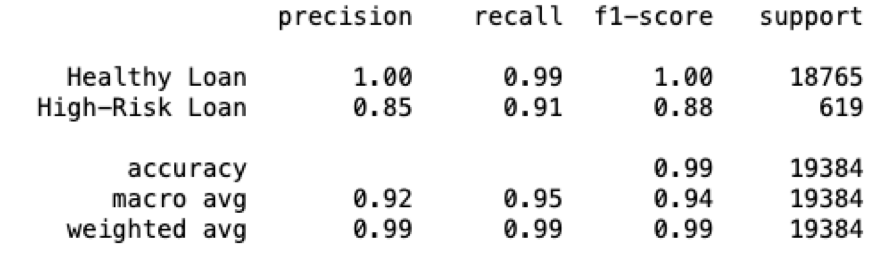
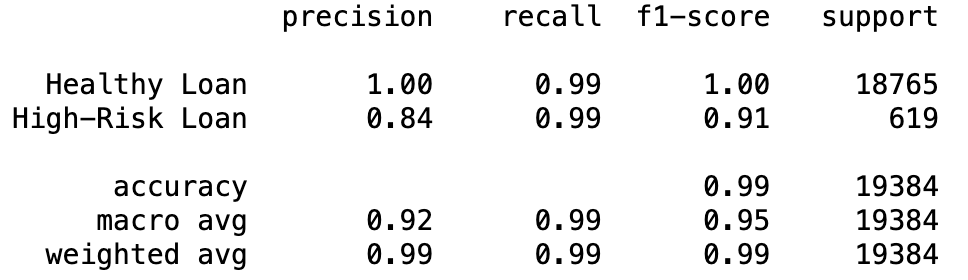

# credit-risk-classification

## Table of Contents
- [Analysis](#questions)
- [Results](#results)
- [Summary](#summary)
- [License](#license)
- [Contact](#contact)

## Questions 
* What is the purpose of the analysis?
I was given current loan data from customers who have a loan. The intention is to predict future High risk or Healthy loans from customers using Logistic Regression on the original and resampled data.

* Explain what financial information the data was on, and what you needed to predict.
The predictions are based on loan_status.

* What variable were being predicted?
Original data value_counts:
    0    75036
    1     2500
Over Sampled value_counts:
    0    56271
    1    56271

* Describe the stages of the machine learning process.
After reviewing the data provided, I separated it into features X and outcome y. Then used train_test_split and then used logistic regression to train the model and made predictions with the test data. Once done I evaluated the confusion matrix and classification report for accuracy. 
Since the original data set was unbalanced on the loan status feature, I used RandomOverSampler to have a more balanced data set. After the new data set was determined it was run through the Logistic Regression model as well, and then it was evaluated. 

* What methods were used?
SKLearn LogisticRegression
train_test_split
confusion matrix
classification report
imblearn.over_sampling

## Results
* Machine Learning Model 1:
  * Accuracy: .99
  * Precision-
        Healthy: 1
        High-Risk: .85
  * Recall-
        Healthy:.99
        High-Risk: .91

  Model is least like to produce false negatives Healthy Loan (.99) High-Risk (.91).

  

* Machine Learning Model 2:
  * Accuracy: .99
  * Precision-
        Healthy: 1 
        High-Risk: .84
  * Recall-
        Healthy:.99
        High-Risk: .99

  

## Summary
Summarize the results of the machine learning models, and include a recommendation on the model to use, if any. For example:
* Which one seems to perform best? How do you know it performs best?
    The Oversampled Logistic Regression model performed well. The precision and recall were very high. 

* Does performance depend on the problem we are trying to solve? (For example, is it more important to predict the `1`'s, or predict the `0`'s?)
    Model does a better job at predicting Healthy Loans(0s). For High-Risk(1s) the precision is .84 and the recall is .99. The model is more likely to produce false positives than false negatives. 

I would like to test against different data sets to determine the best model moving forward. 

## License
MIT

## Contact
If there are any questions of concerns, I can be reached at:
##### [github: velvetklr](https://github.com/velvetklr)
##### [email: velvetklr@gmail.com](mailto:velvetklr@gmail.com)

